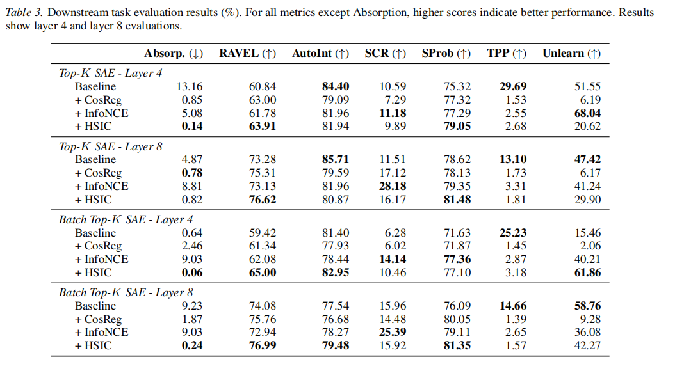
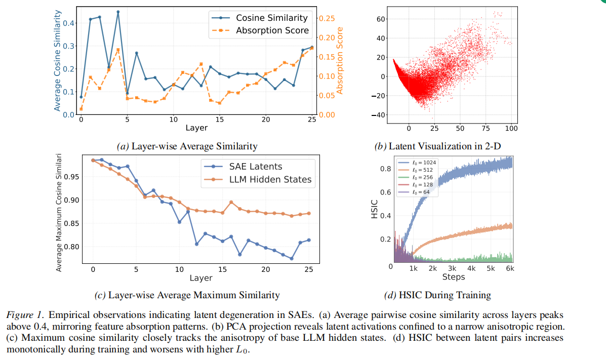

# Unlocking Atom Semanticity

In this work,we propose Independence Regularized Sparse AutoEncoders (IR-SAE), a framework designed
to counteract this degeneration by enforcing statistical independence among latents. We validate
IR-SAE by integrating it with different SAE variants, specifically Top-K and Batch Top-K SAEs.
Extensive experiments demonstrate that our approach effectively alleviates latent degeneration
and reduces feature absorption, yielding features
with significantly higher semantic granularity

## Overview

- [Enviroment](#Enviroment)
- [Train](#Train)
- [Evaluation](#Evaluation)
- [Paper](#paper)
---
## Getting Started
### Enviroment
**To build the environment, use the provided Conda environment file:：**
```bash
conda env create -f environment.yml
```

### Train

#### Training Data
[EleutherAI/fineweb-edu-dedup-10b](https://huggingface.co/datasets/EleutherAI/fineweb-edu-dedup-10b)

#### To train the model with default settings:

```bash
python dictionary_learning/train.py 
```


---

### Evaluation

#### To evaluate the trained model by SAEBench, run:

```bash
python SAEBench/evaluate.py
```

#### Evaluation Type

##### core, absorption, sparse_probing, unlearning, tpp, scr, ravel, autointerp


#### Experiment



#### To do Empirical observations indicating latent degeneration in SAEs, run:
```bash
1. dictionary_learning/evaluate/scripts/cos_sim_across_layers_gemma-scope.ipynb
2. dictionary_learning/evaluate/scripts/Layer-wise_Similarity.ipynb
3. dictionary_learning/evaluate/scripts/svd_projection.ipynb

```

## [Paper ](paper/main.pdf)

 


---

## License

MIT
